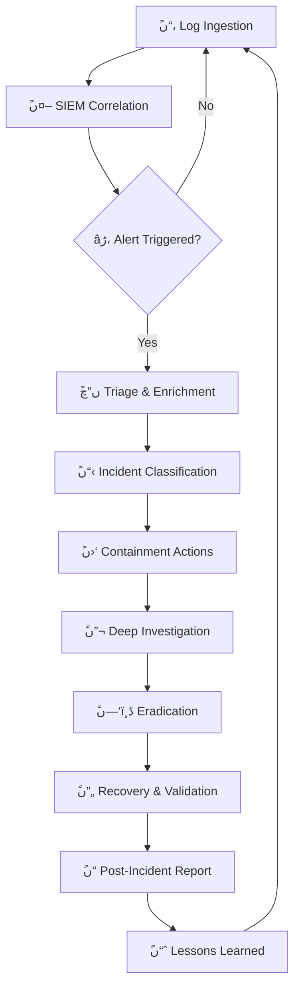

<p align="center">
  <picture>
    <source media="(prefers-color-scheme: dark)" srcset="https://capsule-render.vercel.app/api?type=waving&color=0:0D1117,50:00BFFF,100:32CD32&height=220&section=header&text=Mohamed%20Hany%20Elamrawy&fontSize=42&fontColor=FFFFFF&fontAlignY=32&desc=Cybersecurity%20Engineer%20%7C%20SOC%20Analyst%20%7C%20Blue%20Team&descAlignY=55&descSize=16">
    
  </picture>
</p>

<div align="center">
  
</div>

<br>

<!-- Status Bar -->
<div align="center">
  <table>
    <tr>
      <td>
        
        
        
        
      </td>
    </tr>
    <tr>
      <td>
        
        
      </td>
    </tr>
  </table>
</div>

<br>

---

## ًں“، Command Center — Overview

<table>
  <tr>
    <td width="55%">
      <pre>
<strong>USER</strong>        : Mohamed Hany Elamrawy
<strong>ROLE</strong>        : Cybersecurity Engineer & SOC Analyst
<strong>EDUCATION</strong>   : B.Sc. Communications Engineering (Very Good)
<strong>CERT_TRACK</strong>  : CCNA → CCNP → NSE4 → NSE5 → FCP → CEHâڑ،
<strong>FOCUS</strong>       : Threat Detection | Incident Response | SOC Operations
<strong>METHODOLOGY</strong> : NIST CSF | MITRE ATT&CK | Cyber Kill Chain
<strong>STATUS</strong>      : ًں”µ Active — Open for SOC & Security Engineering roles
      </pre>
    </td>
    <td width="45%" align="center">
      
      <br><br>
      
    </td>
  </tr>
</table>

<br>

---

## ًں›،ï¸ڈ SOC Stack — Security Tooling

<div align="center">

<table>
  <tr>
    <th colspan="6" align="center"></th>
  </tr>
  <tr>
    <td align="center"></td>
    <td align="center"></td>
    <td align="center"></td>
    <td align="center"></td>
    <td align="center"></td>
  </tr>
</table>

<br>

<table>
  <tr>
    <th colspan="5" align="center"></th>
  </tr>
  <tr>
    <td align="center"></td>
    <td align="center"></td>
    <td align="center"></td>
    <td align="center"></td>
    <td align="center"></td>
  </tr>
</table>

<br>

<table>
  <tr>
    <th colspan="5" align="center"></th>
  </tr>
  <tr>
    <td align="center"></td>
    <td align="center"></td>
    <td align="center"></td>
    <td align="center"></td>
    <td align="center"></td>
  </tr>
</table>

<br>

<table>
  <tr>
    <th colspan="4" align="center"></th>
  </tr>
  <tr>
    <td align="center"></td>
    <td align="center"></td>
    <td align="center"></td>
    <td align="center"></td>
  </tr>
</table>

</div>

<br>

---

## ًںڈ… Certifications — Credential Vault

<div align="center">

| # | Certification | Issuer | ID | Status | Badge |
|:-:|:-------------|:------|:--:|:------:|:-----:|
| 1 | **CCNA** | Cisco Systems | `Cisco-Cert-001` | ✅ Verified |  |
| 2 | **CCNP Enterprise** | Cisco Systems | `Cisco-Cert-002` | ✅ Verified |  |
| 3 | **NSE4 FortiOS Admin** | Fortinet | `NSE4-2024` | ✅ Verified |  |
| 4 | **NSE5 FortiAnalyzer** | Fortinet | `NSE5-2024` | ✅ Verified |  |
| 5 | **FCP Security Ops** | Fortinet | `FCP-2024` | ✅ Verified |  |
| 6 | **CEH v12** | EC-Council | `In-Progress` | ًں”„ Active |  |

</div>

<p align="center">
  
  
  
  
  
  
  <br>
  <sub>ًں”’ 5 verified credentials • 1 in progress • All vendor-recognized</sub>
</p>

<br>

---

## ًںڑ€ Featured Projects — Security Labs & Tools

<br>

<div align="center">
  <table>
    <tr>
      <td width="33%" valign="top">
        <h3 align="center">ًں–¥ï¸ڈ SOC Home Lab</h3>
        <p align="center">
          
          <br><br>
          <b>Full SOC environment</b> with Splunk SIEM, Wazuh EDR, FortiGate firewall, and Windows AD. Real-time log ingestion, custom correlation rules, and automated alerting pipelines.
        </p>
        <p align="center">
          <code>Splunk</code> <code>Wazuh</code> <code>FortiGate</code> <code>AD</code> <code>Kali</code>
        </p>
        <p align="center">
          <a href="#"></a>
        </p>
      </td>
      <td width="33%" valign="top">
        <h3 align="center">ًںژ¯ AD Attack & Detection</h3>
        <p align="center">
          
          <br><br>
          <b>Active Directory attack simulation</b> covering Kerberoasting, Pass-the-Hash, Golden Ticket, DCSync. Paired with Splunk detection rules, Sigma rules, and Atomic Red Team.
        </p>
        <p align="center">
          <code>AD</code> <code>Splunk</code> <code>MITRE</code> <code>PowerShell</code> <code>Sigma</code>
        </p>
        <p align="center">
          <a href="#"></a>
        </p>
      </td>
      <td width="33%" valign="top">
        <h3 align="center">ًں”’ Brute Force Detection</h3>
        <p align="center">
          
          <br><br>
          <b>Multi-vector brute force detection engine</b> monitoring RDP, SSH, and web app logins. SIEM correlation + FortiGate auto-blocking + custom Python alerting.
        </p>
        <p align="center">
          <code>Splunk</code> <code>FortiGate</code> <code>Python</code> <code>Wazuh</code> <code>IR</code>
        </p>
        <p align="center">
          <a href="#"></a>
        </p>
      </td>
    </tr>
    <tr>
      <td width="33%" valign="top">
        <h3 align="center">ًںŒگ Threat Intel Dashboard</h3>
        <p align="center">
          
          <br><br>
          <b>Aggregated threat intelligence</b> from MISP, AlienVault OTX, AbuseIPDB. Automated IOC enrichment, TheHive case management, and ELK visualization.
        </p>
        <p align="center">
          <code>MISP</code> <code>TheHive</code> <code>ELK</code> <code>Python</code> <code>OSINT</code>
        </p>
        <p align="center">
          <a href="#"></a>
        </p>
      </td>
      <td width="33%" valign="top">
        <h3 align="center">ًں”چ Vuln Scanner Pipeline</h3>
        <p align="center">
          
          <br><br>
          <b>Automated vulnerability scanning</b> integrating Nessus, Nmap, OpenVAS. Executive reporting, remediation tracking, and trend analytics dashboards.
        </p>
        <p align="center">
          <code>Nessus</code> <code>Nmap</code> <code>Python</code> <code>PowerBI</code> <code>Reports</code>
        </p>
        <p align="center">
          <a href="#"></a>
        </p>
      </td>
      <td width="33%" valign="top">
        <h3 align="center">ًں“ٹ SIEM Rules Pack</h3>
        <p align="center">
          
          <br><br>
          <b>Curated SIEM detection rule collection</b> — Splunk SPL, Sigma, Wazuh decoders, and FortiGate IPS signatures. MITRE ATT&CK mapped and production-tested.
        </p>
        <p align="center">
          <code>Sigma</code> <code>SPL</code> <code>YARA</code> <code>MITRE</code> <code>Detection</code>
        </p>
        <p align="center">
          <a href="#"></a>
        </p>
      </td>
    </tr>
  </table>
</div>

<br>

---

## ًں“ٹ Security Operations Dashboard — GitHub Activity

<div align="center">
  <table>
    <tr>
      <td>
        
      </td>
      <td>
        
      </td>
    </tr>
  </table>
</div>

<div align="center">
  
</div>

<br>

---

## ًں”„ SOC Investigation Workflow



<br>

---

## ًں“، Live Cyber Defense Metrics

```text
┌─────────────────────────────────────────────────────â”گ
│           SOC DASHBOARD — WEEK 24, 2026              │
├─────────────────────────────────────────────────────┤
│  ًں”´ CRITICAL Alerts         ████████████░░░░  62%  │
│  ًںں  HIGH Alerts             ██████████████░░  78%  │
│  ًںں، MEDIUM Alerts           ████████████████░  84%  │
│  ًںں¢ LOW Alerts              █████████████████  96%  │
│                                                     │
│  Mean Time to Detect (MTTD)      ████████░░  12 min│
│  Mean Time to Respond (MTTR)     ████████░░  28 min│
│  Total Alerts Processed          ████████░░  1,247 │
│  False Positive Rate             ████████░░  8.3%  │
│  Escalations to Tier 2           ████████░░  47     │
└─────────────────────────────────────────────────────â”ک
```

<br>

---

## ًںŒگ Connect — Secure Channel

<div align="center">
  <table>
    <tr>
      <th align="center">Platform</th>
      <th align="center">Link</th>
      <th align="center">Status</th>
    </tr>
    <tr>
      <td align="center"></td>
      <td align="center"><a href="mailto:mohamedelamrawy@example.com">mohamedelamrawy@example.com</a></td>
      <td align="center">ًںں¢ Active</td>
    </tr>
    <tr>
      <td align="center"></td>
      <td align="center"><a href="https://linkedin.com/in/mohamedelamrawy">/in/mohamedelamrawy</a></td>
      <td align="center">ًںں¢ Active</td>
    </tr>
    <tr>
      <td align="center"></td>
      <td align="center"><a href="#">/p/USERNAME</a></td>
      <td align="center">ًںں¢ Active</td>
    </tr>
    <tr>
      <td align="center"></td>
      <td align="center"><a href="#">/profile/USERNAME</a></td>
      <td align="center">ًںں، Occasional</td>
    </tr>
    <tr>
      <td align="center"></td>
      <td align="center"><a href="#">@mohamedelamrawy</a></td>
      <td align="center">ًں”´ Inactive</td>
    </tr>
    <tr>
      <td align="center"></td>
      <td align="center"><a href="#">Mohamedelamrawy#0001</a></td>
      <td align="center">ًںں¢ Active</td>
    </tr>
  </table>
</div>

<br>

<div align="center">
  <a href="mailto:mohamedelamrawy@example.com"></a>
  <a href="https://linkedin.com/in/mohamedelamrawy"></a>
  <a href="#"></a>
  <a href="#"></a>
  <a href="#"></a>
  <a href="#"></a>
  <a href="#"></a>
</div>

<br>

---

## ًں§  Continuous Learning

<div align="center">

| Currently Studying | Focus Area | Expected Completion |
|:------------------|:-----------|:-------------------:|
| ًں”´ CEH (Certified Ethical Hacker) | Penetration Testing & Ethical Hacking | Q3 2026 |
| ًں”µ Advanced Threat Intelligence | CTI frameworks, feeds, and analysis | Q4 2026 |
| ًںں¢ Cloud Security (AWS/Azure) | Cloud SOC, GuardDuty, Sentinel | Q1 2027 |
| ًںں، Python for Security Automation | SOAR playbooks, API automation | Ongoing |

</div>

<br>

---

## ًںژ¯ Featured TryHackMe Progress

<div align="center">
  
  <br>
  <sub>⬆ï¸ڈ <em>Replace USERNAME with your TryHackMe username to show your badge</em></sub>
</div>

<br>

---

## ًںڈ† GitHub Profile Trophies

<div align="center">
  
</div>

<br>

---

## ًں“Œ Pinned Projects

<div align="center">
  <table>
    <tr>
      <td>
        <a href="#">
          
        </a>
      </td>
      <td>
        <a href="#">
          
        </a>
      </td>
    </tr>
    <tr>
      <td>
        <a href="#">
          
        </a>
      </td>
      <td>
        <a href="#">
          
        </a>
      </td>
    </tr>
  </table>
</div>

<br>

---

<p align="center">
  <picture>
    <source media="(prefers-color-scheme: dark)" srcset="https://raw.githubusercontent.com/platane/platane/output/github-contribution-grid-snake-dark.svg">
    <source media="(prefers-color-scheme: light)" srcset="https://raw.githubusercontent.com/platane/platane/output/github-contribution-grid-snake.svg">
    
  </picture>
</p>

---

<p align="center">
  
</p>

<div align="center">
  
  
  
  <br><br>
  <sub>âڑ، <strong>Mohamed Hany Elamrawy</strong> — Cybersecurity Engineer & SOC Analyst | آ© 2026 | Defending networks, one alert at a time.</sub>
  <br>
  <sub>ًں›،ï¸ڈ <em>"Trust but verify. Detect then respond."</em></sub>
</div>
