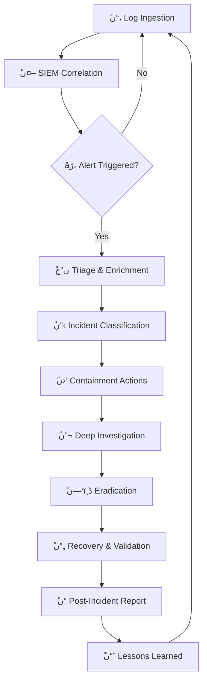

<p align="center">
  <picture>
    <source media="(prefers-color-scheme: dark)" srcset="https://capsule-render.vercel.app/api?type=waving&color=0:0D1117,50:00BFFF,100:32CD32&height=220&section=header&text=Mohamed%20Hany%20Elamrawy&fontSize=42&fontColor=FFFFFF&fontAlignY=32&desc=SOC%20Analyst%20%7C%20TIR1%20%7C%20Cybersecurity%20Engineer&descAlignY=55&descSize=16">
    
  </picture>
</p>

<div align="center">
  
</div>

<br>

<div align="center">
  <table>
    <tr>
      <td>
        
        
        
        
      </td>
    </tr>
    <tr>
      <td>
        
        
      </td>
    </tr>
  </table>
</div>

<br>

---

## ًں“، Command Center — Overview

<table>
  <tr>
    <td width="55%">
      <pre>
<strong>USER</strong>        : Mohamed Hany Elamrawy
<strong>ROLE</strong>        : SOC Analyst - TIR1
<strong>PHONE</strong>       : +201004570713
<strong>EMAIL</strong>       : mohamedelamrawy7@gmail.com
<strong>EDUCATION</strong>   : B.Sc. Communications Engineering (Very Good) | 2019-2024
<strong>CERT_TRACK</strong>  : NSE4 → NSE5 → FCP → FortiSIEM → eCIR → CEHâڑ،
<strong>FOCUS</strong>       : SOC Operations | Threat Detection | Pentesting
<strong>STATUS</strong>      : ًں”µ Active — Open for SOC & Security roles
      </pre>
    </td>
    <td width="45%" align="center">
      
      <br><br>
      
    </td>
  </tr>
</table>

<br>

---

## ًں‘¨â€چًں’» About Me

```yaml
summary: >
  An aspiring Cybersecurity Analyst with hands-on expertise in SOC Operations
  and Penetration Testing. Proficient in managing SIEM platforms (Splunk,
  FortiSIEM) and executing vulnerability assessments. Proven track record in
  bridging technical security requirements with business objectives through
  international tender management and proposal writing.
experience:
  - role: "Pre-Sales Cybersecurity Engineer"
    company: Human Intelligence
    period: "March 2025 – May 2026"
    highlights:
      - Managed cybersecurity tenders across Egypt, Rwanda, and Russia
      - Positioned security solutions for healthcare and telemedicine sectors
      - Prepared technical & financial proposals aligned with regulations
      - Conducted PoC demonstrations during presales process
      - Contributed to winning Housing & Development Bank cybersecurity tender

  - role: "SOC Trainee"
    company: National Telecommunications Institute (NTI)
    period: "January 2026 – April 2026"
    highlights:
      - Built foundations in networking, Linux, and FortiGate administration
      - Performed pentesting and vulnerability analysis across networks & web
      - Used Splunk, QRadar, FortiSIEM for monitoring & incident analysis
      - Applied threat hunting, incident response, and reporting practices

  - role: "Cybersecurity Intern (Penetration Testing)"
    company: Cyberteq
    period: "June 2025 – August 2025"
    highlights:
      - Executed web and network pentesting on live targets
      - Used Burp Suite, Nmap, OWASP ZAP for vulnerability discovery
      - Identified & exploited OWASP Top 10 vulnerabilities
      - Authored technical reports with actionable mitigation strategies
```

---

## ًں›،ï¸ڈ Technical Arsenal

<div align="center">

<table>
  <tr>
    <th colspan="5" align="center"></th>
  </tr>
  <tr>
    <td align="center"></td>
    <td align="center"></td>
    <td align="center"></td>
    <td align="center"></td>
    <td align="center"></td>
  </tr>
</table>

<br>

<table>
  <tr>
    <th colspan="5" align="center"></th>
  </tr>
  <tr>
    <td align="center"></td>
    <td align="center"></td>
    <td align="center"></td>
    <td align="center"></td>
    <td align="center"></td>
  </tr>
</table>

<br>

<table>
  <tr>
    <th colspan="5" align="center"></th>
  </tr>
  <tr>
    <td align="center"></td>
    <td align="center"></td>
    <td align="center"></td>
    <td align="center"></td>
    <td align="center"></td>
  </tr>
</table>

<br>

<table>
  <tr>
    <th colspan="5" align="center"></th>
  </tr>
  <tr>
    <td align="center"></td>
    <td align="center"></td>
    <td align="center"></td>
    <td align="center"></td>
    <td align="center"></td>
  </tr>
</table>

</div>

<br>

---

## ًںڈ… Certifications

<div align="center">

| # | Certification | Issuer | Date | Status | Badge |
|:-:|:-------------|:------|:---:|:------:|:-----:|
| 1 | **NSE 4 — FortiOS 7.6 Administrator** | Fortinet | May 2026 | ✅ Certified |  |
| 2 | **NSE 5 — FortiAnalyzer 7.6 Analyst** | Fortinet | March 2026 | ✅ Certified |  |
| 3 | **FCP — Security Operations** | Fortinet | May 2026 | ✅ Certified |  |
| 4 | **FortiSIEM 7.4 Analyst** | Fortinet | Ongoing | ًں”„ In Progress |  |

</div>

<p align="center">
  
  
  
  
  <br>
  <sub>ًں”’ 3 Fortinet certified • 1 in progress</sub>
</p>

<br>

---

## ًں“ڑ Training & Courses

<div align="center">

| Institution | Course | Status |
|:-----------|:-------|:------:|
| ًںں¦ **IT Gate** | CEH — Certified Ethical Hacker | ًں”„ Ongoing |
| ًںں¦ **IT Gate** | CCNA — Cisco Certified Network Associate | ✅ Completed |
| ًںں¦ **IT Gate** | MCSA — Microsoft Certified Solutions Associate | ✅ Completed |
| ًںں¦ **IT Gate** | Red Hat Linux Administration | ✅ Completed |
| ًں”´ **NTI** | SIEM Solutions (QRadar, Splunk, FortiSIEM) | ✅ Completed |
| ًں”´ **NTI** | FortiAnalyzer Analyst | ✅ Completed |
| ًں”´ **NTI** | FortiGate 7.4 Administration | ✅ Completed |
| ًں”´ **NTI** | Cisco CyberOps Associate | ✅ Completed |
| ًں”´ **NTI** | Network Security | ✅ Completed |
| ًںں© **TryHackMe** | Jr Penetration Tester | ✅ Completed |
| ًںں¨ **Self Study** | eWPTv2 — Web Application Pen Testing | ✅ Completed |
| ًںںھ **NET Riders Academy** | eCIR — Certified Incident Responder | ✅ Completed |

</div>

<br>

---

## ًںڑ€ Projects

<br>

<div align="center">
  <table>
    <tr>
      <td width="50%" valign="top">
        <h3 align="center">ًں–¥ï¸ڈ SOC Home Lab</h3>
        <p align="center">
          
        </p>
        <p align="left">
          Built a complete SOC environment with Wazuh SIEM for log collection, correlation, and alerting. Simulated privilege escalation, lateral movement, and credential dumping in a controlled Active Directory environment. Detected indicators of compromise and documented mitigation strategies including account lockout policies, access control hardening, and detection rule tuning.
        </p>
        <p align="center">
          <code>Wazuh</code> <code>AD</code> <code>Kali</code> <code>Windows Server</code> <code>Sigma</code>
        </p>
        <p align="center">
          <a href="#"></a>
        </p>
      </td>
      <td width="50%" valign="top">
        <h3 align="center">ًںژ¯ AD Attack Simulation & Detection</h3>
        <p align="center">
          
        </p>
        <p align="left">
          Simulated privilege escalation, lateral movement, and credential dumping techniques in a controlled Active Directory environment. Detected malicious activity indicators using Wazuh SIEM correlation rules. Proposed and documented mitigation strategies including account lockout policies, access control hardening, and detection rule tuning aligned with MITRE ATT&CK.
        </p>
        <p align="center">
          <code>AD</code> <code>Wazuh</code> <code>MITRE</code> <code>PowerShell</code> <code>Kali</code>
        </p>
        <p align="center">
          <a href="#"></a>
        </p>
      </td>
    </tr>
    <tr>
      <td width="50%" valign="top">
        <h3 align="center">ًں”’ Brute Force Detection & Security Monitoring</h3>
        <p align="center">
          
        </p>
        <p align="left">
          Detected brute-force attacks via failed authentication pattern analysis using Wazuh SIEM. Monitored authentication logs for repeated failed login attempts across RDP and SSH services. Implemented account lockout policies as primary mitigation and developed correlation rules for real-time alerting on brute-force indicators.
        </p>
        <p align="center">
          <code>Wazuh</code> <code>Windows</code> <code>Linux</code> <code>SIEM</code> <code>IR</code>
        </p>
        <p align="center">
          <a href="#"></a>
        </p>
      </td>
      <td width="50%" valign="top">
        <h3 align="center">ًںŒگ Web & Network Pentesting Lab</h3>
        <p align="center">
          
        </p>
        <p align="left">
          Performed hands-on web application and network penetration testing in captured environments using Burp Suite, Nmap, and OWASP ZAP. Identified and exploited OWASP Top 10 vulnerabilities alongside network misconfigurations. Authored detailed technical reports with risk ratings and actionable remediation steps.
        </p>
        <p align="center">
          <code>Burp Suite</code> <code>Nmap</code> <code>OWASP ZAP</code> <code>Kali</code> <code>Python</code>
        </p>
        <p align="center">
          <a href="#"></a>
        </p>
      </td>
    </tr>
  </table>
</div>

<br>

---

## ًں“ٹ GitHub Activity Dashboard

<div align="center">
  <table>
    <tr>
      <td>
        
      </td>
      <td>
        
      </td>
    </tr>
  </table>
</div>

<div align="center">
  
</div>

<br>

---

## ًں”„ SOC Investigation Workflow



<br>

---

## ًں§  Soft Skills

<div align="center">

| âڑ، Problem Solving | ًں’¬ Communication | ًں“– Eagerness to Learn | âڈ° Time Management | ًں”€ Multitasking |
|:------------------:|:----------------:|:---------------------:|:------------------:|:---------------:|
|  |  |  |  |  |

</div>

<br>

---

## ًںŒگ Languages

<div align="center">

| Language | Level |
|:--------:|:-----:|
|  | ًں‡ھًں‡¬ Native |
|  | ًںŒچ Professional Working |

</div>

<br>

---

## ًں“، SOC Dashboard — Weekly Metrics

```text
┌─────────────────────────────────────────────────────â”گ
│           SOC DASHBOARD — WEEK 24, 2026              │
├─────────────────────────────────────────────────────┤
│  ًں”´ CRITICAL Alerts         ████████████░░░░  62%  │
│  ًںں  HIGH Alerts             ██████████████░░  78%  │
│  ًںں، MEDIUM Alerts           ████████████████░  84%  │
│  ًںں¢ LOW Alerts              █████████████████  96%  │
│                                                     │
│  Mean Time to Detect (MTTD)      ████████░░  12 min│
│  Mean Time to Respond (MTTR)     ████████░░  28 min│
│  Total Alerts Processed          ████████░░  1,247 │
│  False Positive Rate             ████████░░  8.3%  │
│  Escalations to Tier 2           ████████░░  47     │
└─────────────────────────────────────────────────────â”ک
```

<br>

---

## ًںŒگ Connect

<div align="center">
  <table>
    <tr>
      <th align="center">Platform</th>
      <th align="center">Link</th>
      <th align="center">Status</th>
    </tr>
    <tr>
      <td align="center"></td>
      <td align="center"><a href="mailto:mohamedelamrawy7@gmail.com">mohamedelamrawy7@gmail.com</a></td>
      <td align="center">ًںں¢ Active</td>
    </tr>
    <tr>
      <td align="center"></td>
      <td align="center">+201004570713</td>
      <td align="center">ًںں¢ Active</td>
    </tr>
    <tr>
      <td align="center"></td>
      <td align="center"><a href="https://linkedin.com/in/mohamed-hany-elamrawy">/in/mohamed-hany-elamrawy</a></td>
      <td align="center">ًںں¢ Active</td>
    </tr>
    <tr>
      <td align="center"></td>
      <td align="center"><a href="#">/p/USERNAME</a></td>
      <td align="center">ًںں¢ Active</td>
    </tr>
    <tr>
      <td align="center"></td>
      <td align="center"><a href="#">/profile/USERNAME</a></td>
      <td align="center">ًںں، Occasional</td>
    </tr>
  </table>
</div>

<br>

<div align="center">
  <a href="mailto:mohamedelamrawy7@gmail.com"></a>
  <a href="https://linkedin.com/in/mohamed-hany-elamrawy"></a>
  <a href="#"></a>
  <a href="#"></a>
</div>

<br>

---

## ًںڈ† GitHub Trophies

<div align="center">
  
</div>

<br>

---

## ًں“Œ Pinned Projects

<div align="center">
  <table>
    <tr>
      <td>
        <a href="#">
          
        </a>
      </td>
      <td>
        <a href="#">
          
        </a>
      </td>
    </tr>
    <tr>
      <td>
        <a href="#">
          
        </a>
      </td>
      <td>
        <a href="#">
          
        </a>
      </td>
    </tr>
  </table>
</div>

<br>

---

<p align="center">
  <picture>
    <source media="(prefers-color-scheme: dark)" srcset="https://raw.githubusercontent.com/platane/platane/output/github-contribution-grid-snake-dark.svg">
    <source media="(prefers-color-scheme: light)" srcset="https://raw.githubusercontent.com/platane/platane/output/github-contribution-grid-snake.svg">
    
  </picture>
</p>

---

<p align="center">
  
</p>

<div align="center">
  
  
  
  <br><br>
  <sub>âڑ، <strong>Mohamed Hany Elamrawy</strong> — SOC Analyst TIR1 | آ© 2026 | Monitoring. Detecting. Responding.</sub>
  <br>
  <sub>ًں›،ï¸ڈ <em>"Trust but verify. Detect then respond."</em></sub>
</div>
